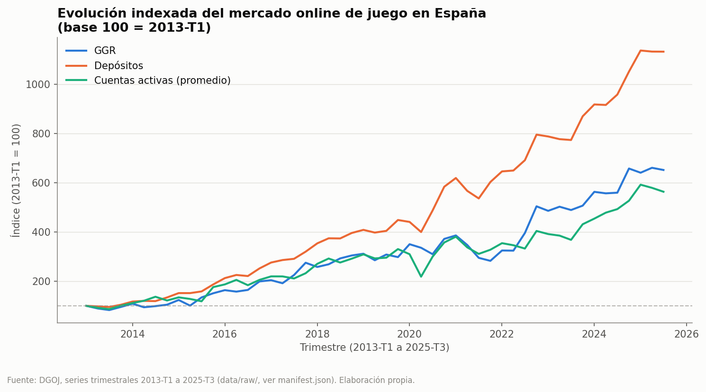
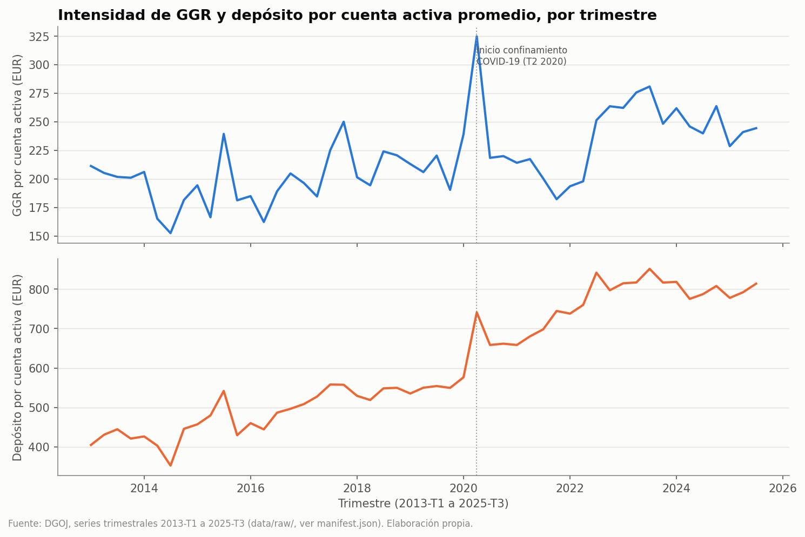
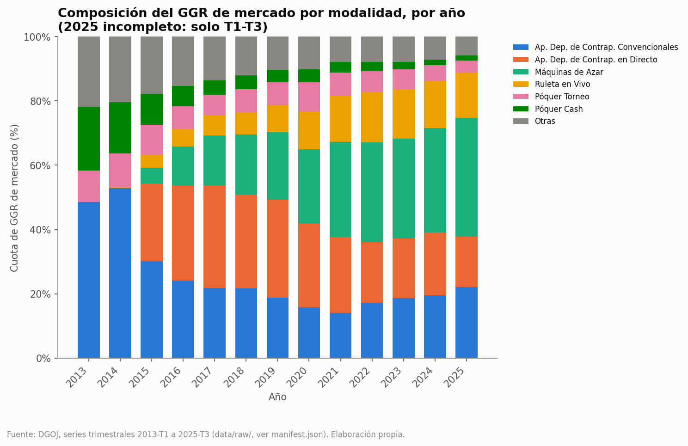

# Responsible Gambling Analytics

Análisis reproducible del mercado español de juego online a partir de datos
públicos agregados de la Dirección General de Ordenación del Juego (DGOJ).

El proyecto descarga, valida, transforma y analiza series temporales de GGR,
cantidades jugadas, depósitos, retiradas, cuentas y marketing. Incluye un modelo
analítico en DuckDB, consultas SQL, 18 pruebas automatizadas y un notebook
ejecutado que GitHub puede mostrar directamente.

> **Alcance:** este proyecto describe tendencias agregadas del mercado. No usa
> microdatos de jugadores, no diagnostica adicción y no permite inferir el riesgo
> de una persona concreta.

## Acceso rápido

- [Abrir el notebook ejecutado](notebooks/01_responsible_gambling_analysis.ipynb)
- [Leer la unidad didáctica completa (PDF)](docs/unidad_didactica.pdf)
- [Consultar el informe de calidad](reports/data_quality_report.md)
- [Revisar las consultas SQL](sql/analysis.sql)

La unidad didáctica explica reproducibilidad, contract testing, EDA, diferencias
entre BI, Data Engineering y Data Science, análisis de series temporales, control
estadístico de procesos, U de Mann–Whitney, errores de tipo I y II, tamaño de
efecto rank-biserial y precauciones ante autocorrelación.

## Pregunta de análisis

> ¿Cómo ha evolucionado la intensidad agregada del juego online en España y qué
> patrones deberían vigilarse desde una perspectiva de juego responsable?

Preguntas secundarias:

1. ¿Cómo evolucionan los depósitos y el GGR por cuenta activa?
2. ¿Qué modalidades concentran una mayor proporción del GGR y cómo cambia su
   composición?
3. ¿Qué relación temporal existe entre gasto promocional, cuentas nuevas y
   depósitos?
4. ¿Se observa un cambio en la distribución de la intensidad a partir de
   2020-T2?

## Datos y unidad de análisis

| Fuente | Contenido | Grano de origen |
|---|---|---|
| `ggr_turnover` | Cantidades jugadas y GGR | mes × modalidad |
| `deposits_withdrawals` | Depósitos, retiradas y número de depósitos | mes × mercado |
| `accounts` | Cuentas activas y cuentas nuevas | mes × mercado |
| `marketing` | Publicidad, bonos, afiliados y patrocinio | mes × mercado |

- Organismo: DGOJ, España.
- Unidad principal: una fila por trimestre del mercado online regulado español.
- Unidad por juego: una fila por trimestre y modalidad.
- Los importes monetarios se tratan en euros.
- Cada descarga se registra en `data/raw/manifest.json` con URL, fecha UTC,
  estado HTTP, tamaño y hash SHA-256.

El notebook versionado contiene una instantánea analizada con cobertura desde
2013-01 hasta 2025-09: 153 meses y 51 trimestres. Como las fuentes son remotas,
una ejecución futura puede incorporar revisiones o periodos nuevos publicados
por la DGOJ.

## Qué se puede concluir

El proyecto permite describir tendencias del mercado, calcular métricas de
intensidad normalizadas por cuenta activa y estudiar cambios en la composición
por modalidad.

No permite:

- diagnosticar juego problemático;
- identificar personas o cuentas de riesgo;
- estimar prevalencia clínica;
- convertir una asociación estadística en causalidad;
- atribuir al COVID-19 todo el cambio observado desde 2020-T2.

## Arquitectura

```text
Fuentes públicas DGOJ
        │
        ▼
src/extract.py ────────► data/raw/*.csv + manifest.json
        │
        ▼
src/profile.py ────────► reports/data_quality_report.md
        │
        ▼
src/transform.py ──────► data/processed/*.csv
        │
        ├── src/validate.py
        ▼
src/build_database.py ─► responsible_gambling.duckdb
        │
        ├── sql/analysis.sql
        ▼
notebooks/01_responsible_gambling_analysis.ipynb
        │
        ▼
reports/figures/*.png
```

## Estructura mínima del repositorio

```text
responsible-gambling-analytics/
├── docs/
│   └── unidad_didactica.pdf
├── notebooks/
│   └── 01_responsible_gambling_analysis.ipynb
├── reports/
│   ├── data_quality_report.md
│   └── figures/
│       ├── 01_market_evolution.png
│       ├── 02_intensity_per_account.png
│       └── 03_game_mix.png
├── sql/
│   ├── analysis.sql
│   └── schema.sql
├── src/
│   ├── __init__.py
│   ├── build_database.py
│   ├── config.py
│   ├── extract.py
│   ├── profile.py
│   ├── transform.py
│   └── validate.py
├── tests/
│   ├── test_database.py
│   ├── test_extraction.py
│   └── test_transform.py
├── .gitattributes
├── .gitignore
├── README.md
└── requirements.txt
```

No es necesario versionar los directorios `data/raw/` y `data/processed/`, la
base `responsible_gambling.duckdb`, las cachés de Python, los checkpoints de
Jupyter ni una segunda copia `_executed.ipynb`. Todos ellos se descargan o se
regeneran mediante el pipeline. El PDF docente sí forma parte del repositorio;
su fuente LaTeX no es necesaria para ejecutar el proyecto.

## Requisitos

- Windows PowerShell.
- Python 3.14 de 64 bits; la versión usada es Python 3.14.4.
- Conexión a Internet durante la extracción inicial.

`requirements.txt` instala las dependencias concretas del proyecto. Se incluye
`notebook` para abrir la interfaz web, pero no el metapaquete `jupyter`.

## Instalación en PowerShell

Desde la raíz del repositorio:

```powershell
py -3.14 -m venv .venv
.\.venv\Scripts\Activate.ps1
python -m pip install --upgrade pip
python -m pip install -r requirements.txt
python -c "import pandas, numpy, duckdb, requests, matplotlib, scipy; print('Dependencias OK')"
```

Si PowerShell bloquea temporalmente la activación del entorno:

```powershell
Set-ExecutionPolicy -Scope Process -ExecutionPolicy Bypass
.\.venv\Scripts\Activate.ps1
```

El cambio de política afecta únicamente a la sesión actual.

## Reproducción completa

Ejecuta los comandos desde la raíz y con `(.venv)` visible en PowerShell:

```powershell
python -m src.extract
python -m src.profile
python -m src.transform
python -m src.validate
python -m src.build_database
python -m pytest -q
python -m nbconvert `
  --to notebook `
  --execute notebooks/01_responsible_gambling_analysis.ipynb `
  --inplace `
  --ExecutePreprocessor.timeout=300
```

La primera orden descarga los cuatro CSV oficiales. Si una descarga local ya
registrada conserva el mismo hash, el extractor la reutiliza. Si el contenido
remoto cambia respecto al manifiesto local, el extractor evita sobrescribirlo
silenciosamente; para aceptar deliberadamente la versión nueva se usa:

```powershell
python -m src.extract --refresh
```

Después de un `--refresh`, vuelve a ejecutar perfilado, transformación,
validación, construcción de la base, tests y notebook.

### Reproducibilidad y límites de la fuente web

El repositorio reproduce el código, el entorno y la secuencia de ejecución. Sin
embargo, al no versionar los CSV descargados, no garantiza recuperar para
siempre exactamente los mismos bytes que publicó la DGOJ en una fecha pasada.
El manifiesto aporta trazabilidad y detección de cambios mediante hash.

Las pruebas unitarias verifican el contrato esperado del extractor con
respuestas simuladas. La descarga real constituye una comprobación de
integración con la DGOJ, pero no forma parte de `pytest`: depende de la red y del
estado actual del proveedor. Si la fuente cambia su URL, formato o columnas, la
extracción o la validación debe fallar de forma explícita.

## Abrir el notebook

Desde la raíz del proyecto y con el entorno activado:

```powershell
python -m notebook ".\notebooks\01_responsible_gambling_analysis.ipynb"
```

Se abrirá Jupyter Notebook en el navegador. Para cerrar el servidor, vuelve a
PowerShell y pulsa `Ctrl+C`; confirma con `y` si lo solicita.

GitHub también renderiza el notebook versionado con sus celdas, resultados y
gráficos, sin necesidad de ejecutarlo ni instalar Jupyter.

## Pruebas automatizadas

La suite contiene 18 tests:

| Nivel | Cantidad | Objetivo |
|---|---:|---|
| Unitarios de extracción | 8 | Validar funciones puras, detección de respuestas inválidas, hashes, manifiesto y comportamiento ante cambios sin acceder a Internet |
| Componentes de transformación | 4 | Comprobar esquemas, agregación mensual a trimestral, métricas derivadas y reglas de calidad sobre datos del proyecto |
| Base de datos e integración local | 6 | Verificar creación de DuckDB, tablas, claves, recuentos, integridad y consultas básicas entre componentes |

Ejecución detallada:

```powershell
python -m pytest -v
```

La descarga en vivo no se cuenta entre los 18 tests. Separarla evita que un fallo
de red convierta una suite local determinista en inestable.

## Calidad y decisiones de transformación

En la instantánea analizada:

- las cuatro fuentes son mensuales y cubren 2013-01 a 2025-09;
- no se detectan huecos ni duplicados en sus claves esperadas;
- `ggr_turnover` forma un panel de 17 modalidades por 153 meses;
- `Nº de depósitos` aparece a cero de forma consistente desde 2018-01 y se
  excluye de las métricas derivadas;
- los flujos —depósitos, retiradas, GGR, cantidades jugadas, marketing y cuentas
  nuevas— se agregan mediante suma;
- `Cuentas activas` se agrega mediante promedio trimestral, porque no es una
  magnitud acumulable.

El detalle está en
[`reports/data_quality_report.md`](reports/data_quality_report.md).

## Modelo analítico y SQL

- `dim_period`: dimensión temporal trimestral.
- `market_quarterly`: métricas agregadas y ratios de intensidad.
- `game_quarterly`: GGR, cantidades jugadas y cuota por modalidad.
- [`sql/analysis.sql`](sql/analysis.sql): cuatro consultas de negocio con su
  pregunta, grano, métricas e interpretación.

Comprobación manual de la base:

```powershell
python -c "import duckdb; c=duckdb.connect('responsible_gambling.duckdb'); print(c.sql('SHOW TABLES').fetchall()); c.close()"
```

## Resultados de la instantánea analizada

| Visual | Pregunta |
|---|---|
|  | ¿Cómo evolucionan GGR, depósitos y cuentas activas? |
|  | ¿En qué periodos aumenta la intensidad normalizada? |
|  | ¿Qué modalidades concentran el GGR? |

Principales observaciones del notebook versionado:

1. Entre 2013-T1 y 2025-T3, el GGR se multiplica por 6,5, los depósitos por
   11,3 y las cuentas activas promedio por 5,6. En 2025 solo hay tres trimestres.
2. La mediana del depósito trimestral por cuenta activa pasa de 491,7 € en
   2013–2019 (`n=28`) a 782,5 € entre 2020-T2 y 2025-T3 (`n=22`).
3. Se observa un salto alrededor de 2020-T2, compatible temporalmente con el
   inicio de la pandemia, pero el diseño observacional no identifica un efecto
   causal del COVID-19 ni separa completamente tendencia y estacionalidad.
4. El contraste U de Mann–Whitney evalúa una diferencia de distribución entre
   los periodos definidos; el efecto rank-biserial cuantifica su magnitud. La
   autocorrelación entre trimestres limita la independencia del contraste, por
   lo que ambos resultados se interpretan como evidencia descriptiva y no como
   una estimación causal.
5. El mix cambia hacia Máquinas de Azar y las tres modalidades principales
   concentran buena parte del GGR del último periodo.

## Dashboard interactivo en Tableau Public

El análisis también está disponible como dashboard interactivo en Tableau
Public. Permite explorar visualmente la evolución del mercado español de juego
online y complementar los resultados reproducibles del notebook.

[**Abrir el dashboard Responsible Gambling Analytics en Tableau Public**](https://public.tableau.com/app/profile/nicolas.parejo/viz/responsible_gambling_analytics/AnlisisdelJuegoOnlineenEspaa?publish=yes)

> GitHub no permite incrustar directamente dashboards interactivos de Tableau
> dentro de un `README.md`. El enlace anterior abre la visualización completa en
> Tableau Public.


## Ética y limitaciones

- **Falacia ecológica:** un patrón agregado no describe necesariamente a una
  persona.
- **Correlación no implica causalidad:** COVID-19, marketing y actividad pueden
  coincidir temporalmente sin una relación causal identificada.
- **Cobertura:** los datos representan el mercado online regulado español, no el
  juego presencial ni el mercado no regulado.
- **Cambios de reporte:** algunas variables y categorías cambian a lo largo del
  tiempo.
- **Autocorrelación y estacionalidad:** reducen la independencia efectiva de las
  observaciones trimestrales.
- **Uso responsable:** las métricas agregadas no deben convertirse en etiquetas
  automáticas de riesgo individual ni emplearse con fines de presión comercial.

## Solución de problemas

### La ruta contiene espacios

Usa comillas dobles:

```powershell
cd "C:\Users\nicol\Documents\tech_interview\Data Analytics bootcamp\Responsible Gambling Analytics"
```

### `ModuleNotFoundError`

Activa el entorno en la misma terminal y confirma el intérprete:

```powershell
.\.venv\Scripts\Activate.ps1
python --version
python -m pip --version
```

Ambos comandos deben apuntar a `.venv` y Python 3.14.

### La DGOJ devuelve HTML o cambia una URL

El extractor debe rechazar una página HTML en lugar de guardarla como CSV.
Revisa las URL configuradas en `src/config.py` y actualiza el contrato de la
fuente antes de aceptar el nuevo formato.

### El contenido remoto tiene otro hash

Comprueba el cambio antes de ejecutar `python -m src.extract --refresh`. Después
regenera todos los artefactos y revisa el diff del notebook, las figuras y el
informe de calidad.

### El notebook no encuentra `src`

Inicia Jupyter desde la raíz del repositorio mediante `python -m notebook` y no
desde la carpeta `notebooks`.

